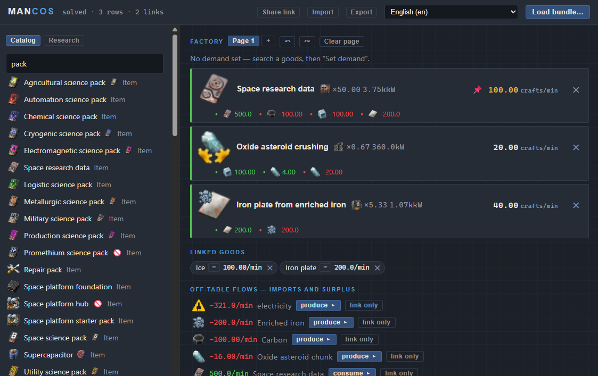
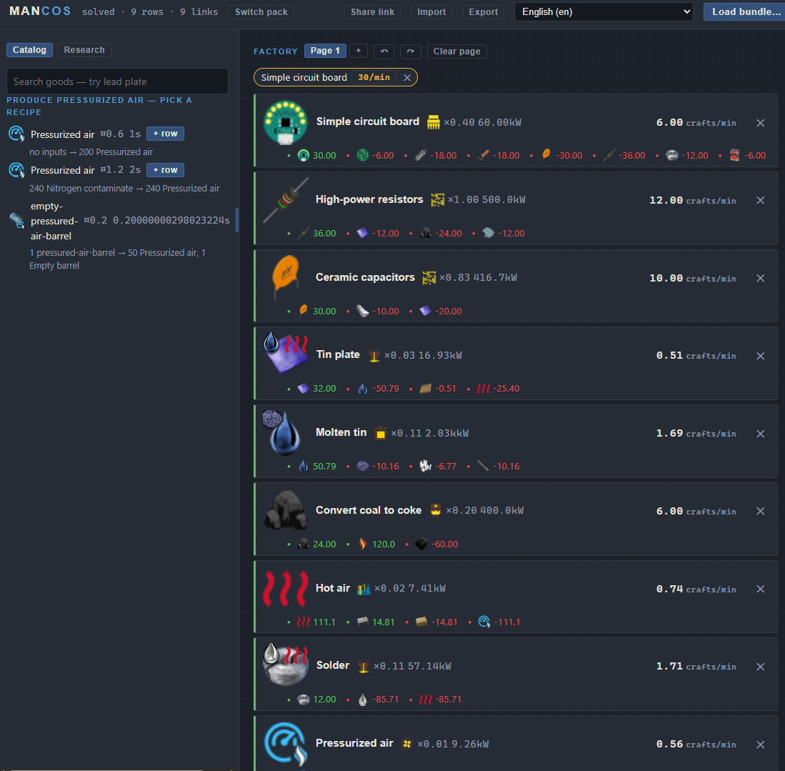

# Mancos

Mancos is yet another yet another yet another factory planner for Factorio. It is an AI (Claude Fable 5 initially) driven port of yafc-ce to C++ and the Web. It uses the same underlying linear programming library for optimizing recipes and loads the same projects as Yafc. As its a source translation this is a seperate project and not a branch of the original project. 

## Features

Mancos is entirely client side, and the main app is less than 2MBs of JS and WASM. The main app uses bundle files to keep recipe data for a mod set together. There are a few bundles provided, and you can use the bundler app to create your own. Currently this requires Chrome to provide directory access, or you can download a node.js app from `releases` to run the bundler locally.

Sharing projects via links works well, the project file is packed into the URL, allowing you to share a build with other users

## Why?

My primary motivation for this was factory planning on the go, for those tragic momements when I couldn't be near my factory. This is also a lower bar to entry for a lot of players.

## Feature Requests

Feel free to file issues on this project. For adding a new pack, if you want to provide the bundle, make sure to remove optional mods that add extraneous recipes (like text plates, LTN, cybersyn, especially editor extensions which pollutes the module interface)

## License

- [GNU GPL 3.0](/LICENSE), same as the YAFC it is ported from.
- Original YAFC copyright ShadowTheAge; community continuation by the
  [yafc-ce contributors](https://github.com/Yafc-CE/yafc-ce).
- Powered by free software: Google OR-Tools, Lua, Emscripten, miniz,
  nlohmann/json, stb and others (see [full list](/licenses.txt)).
- Factorio is the property of Wube Software. Mancos ships no game data or
  assets — users build bundles from their own installation.
